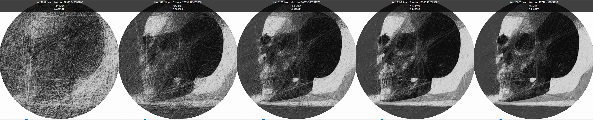

## Efekt po 10000 iteracjach

## String Art Generator
Generator String Art, który wyewoluował z prostej chęci stworzenia unikalnego prezentu. Projekt łączy w sobie zagadnienia z zakresu przetwarzania obrazu, optymalizacji wydajności oraz matematyki stosowanej. 
## Kluczowe funkcjonalności
* Wielokolorowość: Pełne wsparcie dla układania wzorów przy użyciu 4 różnych kolorów nici z uwzględnieniem półprzezroczystości (alpha blending), profilu linii i antyaliasingu.
* Zaawansowany dobór linii: Wykorzystanie metryk błędu takich jak Pearson correlation, cosine similarity, średnie ważone itp. do oceny jakości dopasowania kolejnych nici.
* Inteligentne maskowanie: System masek stymulujący zapełnianie wolnych pikseli, co pozwala uzyskać optymalny efekt wizualny przy zdefiniowanej liczbie linii (np. 3000 linii zamiast trzydziestu tysięcy), co ma kluczowe znaczenie przy fizycznym wykonaniu prac.
* Graficzny Interfejs Użytkownika (GUI): Przejście z prostego wiersza poleceń (CLI) na dedykowany interfejs ze względu na rosnącą liczbę konfigurowalnych parametrów.
## Wyzwania Inżynierskie i Optymalizacje
Projekt stał się poligonem doświadczalnym dla zaawansowanych zagadnień informatycznych:
## Wielowątkowość i determinizm
* Problem: Obliczanie wszystkich możliwych kombinacji linii dla obrazu składającego się z tysięcy elementów zajmowało zbyt dużo czasu (dla 2000 linii trwało to kilka minut).
* Rozwiązanie: Wdrożenie wielowątkowości. Początkowo napotkano problem z niedeterminizmem (drobne błędy synchronizacji sprawiały, że ten sam obraz generował się za każdym razem inaczej przy pełnej analizie kombinacji).
* Wniosek: Zdobycie cennego doświadczenia w poprawnym pisaniu kodu współbieżnego i zarządzaniu stanem przy masowych obliczeniach równoległych.
## Architektura pamięci i optymalizacja pod cache (Cache Locality)
* Problem: Dążenie do maksymalnej wydajności procesora przy intensywnym mieleniu danych.
* Rozwiązanie: W ramach eksperymentów z architekturą CUDA (która ostatecznie została odrzucona ze względu na zbyt sztywne dopasowanie do jednego algorytmu i utrudniającą rozwój) przeniesiono wnioski dotyczące układu danych do kodu CPU. Przebudowa struktur danych pod kątem ograniczenia cache misses podniosła ogólną wydajność aplikacji.
## Algorytmika i Przetwarzanie Obrazu
* Eksperymenty z uczeniem (Machine Learning approach): Próba podejścia do wag warstw na wzór propagacji wstecznej (backpropagation w sieciach neuronowych), gdzie obraz generował się warstwa po warstwie, a obraz wynikowy wpływał na to na jakich częściach powinny się skupić poszczególne warstwy.
* Transformata Radona i Sinogramy: Inspirowane technologią skanerów MRI próby użycia transformaty Radona (początkowo przez OpenCV, a później napisane w pełni od zera dla lepszej wydajności), co drastycznie poprawiło skuteczność.

## Stan projektu i struktura kodu
* Projekt jest w trakcie ciągłego rozwoju i eksperymentów z różnymi funkcjonalnościami
* Niektóre starsze elementy eksperymentalne nie zostały jeszcze całkowicie usunięte.
* W niektórych miejscach kod bywa chaotyczny ze względu na dynamiczny charakter badań. 
